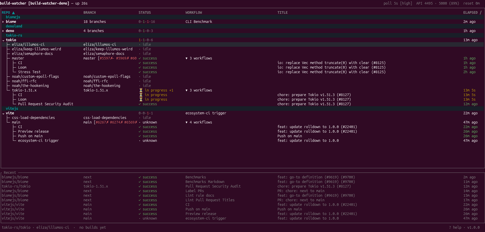

# build-watcher

Stop switching browser tabs to check your CI. **build-watcher** runs quietly in the background, watches your GitHub Actions workflows, and pings you the moment something changes — via desktop notifications, a live terminal dashboard, or right inside Claude Code.

> **Linux and macOS only.**



## What it does

- **Desktop notifications** fire when builds start, succeed, or fail — with a direct link to the run and the name of the failing step
- **Live TUI dashboard** (`bw`) shows all your repos at a glance: active runs, last build status, open PRs, and build history
- **MCP server** lets Claude Code watch repos, rerun failed builds, and check build status without leaving your editor
- Runs as a system service (systemd / launchd) and survives restarts

## Quick start

```sh
curl -fsSL https://raw.githubusercontent.com/wkirschbaum/build-watcher/main/install.sh | bash
```

Then open the TUI — it auto-starts the daemon on first run:

```sh
bw
```

## Requirements

**Authentication** — one of:
- [GitHub CLI](https://cli.github.com/) authenticated with `gh auth login` *(recommended)*
- `GITHUB_TOKEN` environment variable with `repo` and `actions` scopes

**Linux:** GNOME, KDE, or any notification daemon (`dunst`, `mako`); `systemd`

**macOS:** `osascript` (pre-installed); optionally [`terminal-notifier`](https://github.com/julienXX/terminal-notifier) (`brew install terminal-notifier`) for clickable notification links

## Installation

### One-liner

```sh
curl -fsSL https://raw.githubusercontent.com/wkirschbaum/build-watcher/main/install.sh | bash
```

Downloads pre-built binaries for your platform (Linux x86\_64/aarch64, macOS x86\_64/aarch64), installs to `~/.local/bin/`, and sets up the system service.

**Flags:**

| Flag | Description |
| --- | --- |
| `--with-claude` | Register the MCP server in `~/.claude.json` for Claude Code integration |
| `--local` | Build from source instead of downloading a release binary (requires `cargo`) |

Both flags can be combined. Examples:

```sh
# Install and register with Claude Code
curl -fsSL https://raw.githubusercontent.com/wkirschbaum/build-watcher/main/install.sh | bash -s -- --with-claude

# Build from source and register with Claude Code
./install.sh --local --with-claude
```

To register the MCP server after a plain install:

```sh
build-watcher --register
```

### From source via cargo

```sh
cargo install --git https://github.com/wkirschbaum/build-watcher.git
build-watcher --register   # optional: register MCP server with Claude Code
```

Note: `cargo install` skips service setup — run `./install.sh --local` for the full install including systemd/launchd.

## Features

### Notifications

- Start, success, and failure events — configurable per repo, per branch, per event type (`off` / `low` / `normal` / `critical`)
- Notification titles: `✅ succeeded: my-app | CI` — org prefix omitted when the repo name is unambiguous
- Failure notifications include the name of the failing job and step
- Build duration shown on completion
- **Quiet hours** — suppress non-critical notifications on a schedule (e.g. `22:00–07:00`)
- Pause notifications temporarily (timed or indefinite) with `p` in the TUI

### TUI Dashboard

The `bw` dashboard updates in real time over SSE. Repos expand to show per-branch and per-workflow rows.

**Sorting:** repo, branch, status, workflow, age (`s`/`S` to cycle)

**Grouping:** by org, branch, workflow, status, or none (`g`/`G` to cycle)

#### Keybindings

| Key | Action |
| --- | --- |
| `↑`/`↓` or `j`/`k` | Navigate rows |
| `Tab` / `Enter` | Cycle expand level (Collapsed → Branches → Full) |
| `Shift-Tab` / `E` | Cycle expand level for all repos |
| `a` | Add a repo to watch |
| `b` | Set branches for selected repo |
| `d` | Remove selected repo or branch |
| `o` / `O` | Open run in browser / open repo Actions page |
| `r` / `R` | Rerun failed jobs / rerun all jobs |
| `M` | Merge the first open PR targeting the selected branch |
| `n` | Toggle mute for selected repo/branch |
| `N` | Open notification level picker (per-event levels) |
| `p` | Toggle global notification pause |
| `h` | Build history for selected item |
| `H` | Toggle the Recent builds panel |
| `t` / `T` | Build times for selected repo / all repos |
| `c` | Per-repo config (alias, watch PRs, poll aggression) |
| `C` | Global config (ignored workflows, auto-discover, branch filter) |
| `s` / `S` | Cycle sort column forward / backward |
| `g` / `G` | Cycle group-by forward / backward |
| `U` | Self-update (shown when update available) |
| `q` / `Q` | Quit / Quit and stop daemon |
| `?` | Toggle help |

### PR Watch

Enable per-repo with `c` → Watch PRs: on. The TUI shows color-coded merge-readiness badges next to each branch:

| Badge | Meaning |
| --- | --- |
| `#42✓` green | Ready to merge |
| `#43⊘` red | Blocked (failing checks or pending reviews) |
| `#44✗` red | Merge conflict |
| `#45!` yellow | Unstable |
| `#46↓` yellow | Behind base branch |
| `~` suffix | Draft |

Press `M` on a branch row to open the merge dialog. Desktop notifications fire when a PR becomes ready to merge.

### MCP Server

Manage your watches from Claude Code using natural language. The MCP server is registered at `http://127.0.0.1:8417/mcp`.

| Tool | Description |
| --- | --- |
| `watch_builds` | Start watching repos (`owner/repo` format) |
| `watch_from_git_remote` | Auto-detect the repo from the current directory's git remote |
| `stop_watches` | Remove repos from watches |
| `list_watches` | Show all watched repos and their current status |
| `configure_branches` | Set branches, enable auto-discover, set branch filter regex |
| `configure_repo` | Set alias, workflow allow-list, PR watching, ignored events |
| `configure_ignored_events` | Add/remove workflow names or GitHub event types from the ignore list |
| `update_notifications` | Set levels, quiet hours, pause/resume |
| `rerun_build` | Rerun a specific build or the last failed one |
| `build_history` | Recent builds with duration and age |
| `get_stats` | Uptime, poll interval, rate limit usage, config path |
| `set_poll_aggression` | Set rate-limit budget usage: `low` / `medium` / `high` |

### Smart polling

The daemon polls GitHub at an interval that scales dynamically with your API rate-limit budget. ETag caching means unchanged responses return `304 Not Modified` at zero rate-limit cost, so idle repos are essentially free to poll.

| Level | Budget target | Typical interval |
| --- | --- | --- |
| `low` | ≤15% of 5000/hr | ~60s |
| `medium` (default) | ≤40% of 5000/hr | ~5–15s |
| `high` | ≤80% of 5000/hr | ~5s |

When the rate limit hits 0 the daemon pauses automatically and resumes after the GitHub reset (typically within an hour). No builds are missed.

## Configuration

Config lives at `~/.config/build-watcher/config.json` and is edited live — no restart needed.

```json
{
  "poll_aggression": "medium",
  "show_author": true,
  "auto_discover_branches": true,
  "notifications": {
    "build_started": "normal",
    "build_success": "normal",
    "build_failure": "critical"
  },
  "quiet_hours": {
    "start": "22:00",
    "end": "07:00"
  },
  "ignored_workflows": ["Semgrep"],
  "repos": {
    "acme/frontend": {
      "watch_prs": true
    },
    "acme/api": {
      "alias": "API",
      "branches": ["main", "release"],
      "watch_prs": true,
      "notifications": {
        "build_started": "off",
        "build_failure": "critical"
      }
    }
  }
}
```

| Field | Default | Description |
| --- | --- | --- |
| `poll_aggression` | `medium` | Rate-limit budget: `low` (≤15%), `medium` (≤40%), `high` (≤80%) |
| `show_author` | `true` | Show commit author in TUI and notifications (1 extra API call per new run) |
| `auto_discover_branches` | `true` | Auto-watch branches with active runs or open PRs |
| `branch_filter` | — | Regex to filter auto-discovered branches |
| `default_branches` | — | Extra branches watched for repos with no per-repo branch config |
| `notifications` | see above | Global per-event levels: `off`, `low`, `normal`, `critical` |
| `quiet_hours` | — | Local 24h time window to suppress non-critical notifications |
| `ignored_workflows` | — | Workflow names hidden from TUI and excluded from notifications |
| `repos` | `{}` | Per-repo config: `alias`, `branches`, `workflows`, `watch_prs`, `notifications`, `branch_notifications` |

Notification levels cascade: branch overrides → repo overrides → global defaults.

### Multiple instances

Run separate daemons for different GitHub accounts or project sets:

```sh
build-watcher --config-dir ~/.config/build-watcher-work
bw --config-dir ~/.config/build-watcher-work
```

Each instance gets its own config, state, and port. The TUI header shows `[work]` when a non-default instance is active.

### Environment variables

| Variable | Default | Description |
| --- | --- | --- |
| `BUILD_WATCHER_PORT` | `8417` | HTTP port (ignored when `--config-dir` is used) |
| `RUST_LOG` | `build_watcher=info` | Log level |

## Managing the service

**Linux**
```sh
systemctl --user status build-watcher
systemctl --user restart build-watcher
journalctl --user -u build-watcher -f
```

**macOS**
```sh
launchctl kickstart -k "gui/$(id -u)/com.build-watcher"
tail -f ~/Library/Logs/build-watcher.log
```

## Updating

Press `U` in the TUI when an update badge appears, or:

```sh
bw --update
```

To reset cached run state (keeps config):

```sh
bw --reset-state
```

## Troubleshooting

**No builds appearing**
1. Check auth: `gh auth status` or verify `GITHUB_TOKEN` has `repo` + `actions` scopes
2. Check the daemon is running: `bw` auto-starts it, or `systemctl --user status build-watcher`
3. Check logs: `journalctl --user -u build-watcher -n 50` (Linux) / `tail -n 50 ~/Library/Logs/build-watcher.log` (macOS)

**Rate limit exhausted**
Lower `poll_aggression` to `low`, watch fewer repos, or set `auto_discover_branches: false`. The daemon recovers automatically after the GitHub reset.

**Notifications not appearing (Linux)**
Test with `notify-send "test" "hello"`. If that fails, install and start a notification daemon (`dunst`, `mako`, or `notification-daemon`).

**Notifications not clickable (macOS)**
Install `terminal-notifier`: `brew install terminal-notifier`. The daemon auto-detects it on startup — restart the service afterwards.

## REST API

The daemon exposes a REST API on the same port as the MCP server:

| Endpoint | Method | Description |
| --- | --- | --- |
| `/status` | GET | All watches, active runs, and last builds |
| `/stats` | GET | Uptime, poll interval, API rate limit |
| `/events` | GET | SSE stream of watch events |
| `/watch` | POST | Add a repo |
| `/unwatch` | POST | Remove a repo |
| `/branches` | POST | Update branch config |
| `/notifications` | GET/POST | Read or update notification levels |
| `/defaults` | GET/POST | Read or update global config |
| `/repo-config` | GET/POST | Read or update per-repo config |
| `/history` | GET | Build history for a repo |
| `/history/all` | GET | Recent builds across all repos |
| `/pause` | POST | Toggle notification pause |
| `/rerun` | POST | Rerun a build |
| `/merge` | POST | Merge a PR |
| `/shutdown` | POST | Graceful shutdown |

## Uninstalling

```sh
./uninstall.sh
```

Stops the service and removes binaries and the MCP registration. Config and state files are left in place.
